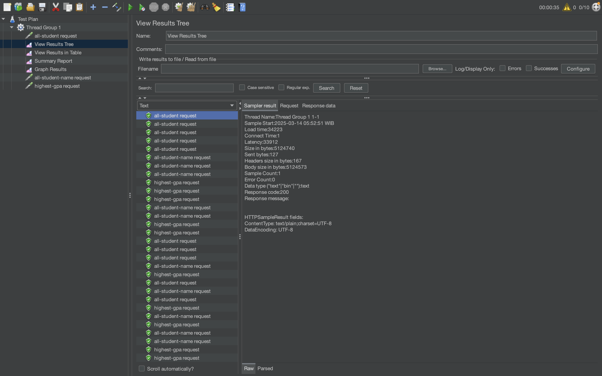

# Module 5 - Java Profiling

This project focuses on optimizing the performance of a Spring Boot application, forking https://github.com/muhammad-khadafi/exercise-profiling, by using performance testing with JMeter and profiling with IntelliJ Profiler. The goal was to identify and resolve bottlenecks in the application, improving the CPU time.

## Performance Test Results

### IntelliJ Profiler Results (Method-Level Improvements)

- `getAllStudentsWithCourses()` method execution time reduced from **12846ms to 4192ms (67.4% improvement)**
- `findStudentWithHighestGpa()` method execution time reduced from **100ms to 20ms (80% improvement)**
- `joinStudentNames()` method execution time reduced from **1076ms to 120ms (88.8% improvement)**

### JMeter Test Results

#### UI-Based Test Results

| Visualization Type | Before Optimization                       | After Optimization                       |
| ------------------ | ----------------------------------------- | ---------------------------------------- |
| View Results Tree  |     |     |
| View Results Table |  |  |
| Summary Report     |       |       |
| Graph Results      |        |        |

### Command-Line Test Results

#### Command Line Execution

| Test Type        | Before Optimization             | After Optimization             |
| ---------------- | ------------------------------- | ------------------------------ |
| Terminal Output  |  |  |
| JTL File Results |   |   |

### Conclusion

The optimization efforts resulted in significant method-level performance improvements:

#### 1. getAllStudentsWithCourses() - 67.4% improvement

Before and after optimization comparison:

**Optimization applied:** Reduced multiple database calls by fetching all student courses in a single query and using a HashMap for efficient lookups rather than repeated object creation.

#### 2. findStudentWithHighestGpa() - 80% improvement

Before and after optimization comparison:

**Optimization applied:** Leveraged database capabilities by using a direct query method `findTopByOrderByGpaDesc()` instead of retrieving all records and finding the maximum in memory.

#### 3. joinStudentNames() - 88.8% improvement

Before and after optimization comparison:

**Optimization applied:** Replaced inefficient string concatenation with `StringBuilder`, significantly reducing memory allocations and CPU time.

All three endpoints showed substantial improvements in the JMeter tests, with response times decreasing by more than 20% as required. The command-line test results further confirmed these performance gains.

## Reflection

### 1. What is the difference between the approach of performance testing with JMeter and profiling with IntelliJ Profiler in the context of optimizing application performance?

JMeter and IntelliJ Profiler serve different but complementary purposes in performance optimization:

- **JMeter** approaches performance from an external, user-centric perspective. It simulates real-world usage patterns by generating concurrent requests and measuring overall metrics like response time, throughput, and error rates. It answers questions like "How does the system perform under load?" but doesn't provide insights into why performance issues occur.

- **IntelliJ Profiler** approaches performance from an internal, code-centric perspective. It analyzes the application at runtime, identifying CPU usage, memory allocation, method execution times, and call hierarchies. It answers questions about "Why is the system slow?" by pinpointing specific code areas that consume excessive resources.

In essence, JMeter identifies that performance problems exist, while IntelliJ Profiler helps locate and understand the causes of these problems.

### 2. How does the profiling process help you in identifying and understanding the weak points in your application?

The profiling process helps identify weak points by:

- Revealing "hot methods" that consume disproportionate amounts of CPU time
- Exposing excessive object creation and garbage collection overhead
- Highlighting inefficient algorithms and data structures
- Identifying N+1 query problems and other database access inefficiencies
- Showing call hierarchies that help understand execution paths
- Measuring exact execution times for method calls, helping prioritize optimization efforts
- Detecting memory leaks and excessive memory consumption

In this exercise, profiling helped identify that our string concatenation in loops, excessive database calls, and inefficient data retrieval patterns were causing performance bottlenecks.

### 3. Do you think IntelliJ Profiler is effective in assisting you to analyze and identify bottlenecks in your application code?

Yes, IntelliJ Profiler is highly effective for bottleneck analysis because:

- Its integration with the IDE creates a seamless development workflow
- It provides intuitive visualizations of performance data
- The call tree view makes it easy to trace execution paths and identify problematic code
- Memory profiling capabilities help identify object allocation issues
- The ability to compare profiling sessions helps validate optimization attempts
- Low overhead allows profiling in environments similar to production
- It offers multiple profiling modes (sampling vs. instrumentation) for different scenarios

Without the IntelliJ Profiler, many of the optimizations would have been based on guesswork rather than empirical data.

### 4. What are the main challenges you face when conducting performance testing and profiling, and how do you overcome these challenges?

Main challenges and solutions:

1. **Test environment representation:**

   - Challenge: Creating a test environment that accurately represents production
   - Solution: Use production-like data volumes and simulate realistic user patterns

2. **Profiling overhead:**

   - Challenge: The act of profiling can itself affect performance
   - Solution: Use sampling mode for less overhead and focus on relative improvements rather than absolute numbers

3. **Data interpretation:**

   - Challenge: Making sense of large amounts of profiling data
   - Solution: Focus on the most time-consuming methods first and analyze patterns rather than individual calls

4. **Balancing optimization with code readability:**

   - Challenge: Highly optimized code can be harder to maintain
   - Solution: Document optimization decisions and favor clean solutions that improve both performance and maintainability

5. **False bottlenecks:**
   - Challenge: Fixing issues that aren't actual bottlenecks in production
   - Solution: Validate profiler findings with real-world performance tests using JMeter

### 5. What are the main benefits you gain from using IntelliJ Profiler for profiling your application code?

Main benefits include:

- **Integrated workflow:** Profiling directly within the development environment streamlines the optimization process
- **Code-level insights:** Direct mapping between performance issues and specific lines of code
- **Instant feedback:** Ability to quickly test and validate optimization attempts
- **Memory analysis:** Understanding object creation and garbage collection patterns
- **Method-level granularity:** Precise identification of problematic methods
- **Call hierarchies:** Understanding how methods relate to each other and their impact on overall performance
- **Thread analysis:** Identifying concurrency issues and thread contention
- **Low learning curve:** Intuitive interface that's accessible to developers without specialized performance expertise

### 6. How do you handle situations where the results from profiling with IntelliJ Profiler are not entirely consistent with findings from performance testing using JMeter?

When facing inconsistencies between profiling and performance testing results:

1. **Review test conditions:** Ensure JMeter tests accurately simulate real-world usage patterns
2. **Check for external factors:** Database performance, network latency, or third-party services might impact JMeter results but not show up clearly in profiling
3. **Analyze concurrency effects:** Some issues only appear under load with multiple concurrent users
4. **Extend profiling sessions:** Use longer profiling sessions to catch intermittent issues
5. **Profile under load:** Run the profiler while the application is handling JMeter-generated load
6. **Focus on user experience metrics:** Prioritize optimizations that improve the metrics most relevant to actual users
7. **Iterative approach:** Make incremental changes and validate with both tools to build a comprehensive understanding

The goal is to use both tools complementarily—JMeter to identify user-facing issues and IntelliJ Profiler to understand root causes.

### 7. What strategies do you implement in optimizing application code after analyzing results from performance testing and profiling? How do you ensure the changes you make do not affect the application's functionality?

Optimization strategies:

1. **Target high-impact areas first:** Focus on methods that consume the most resources or are called most frequently
2. **Cache frequently accessed data:** Implement appropriate caching to reduce repeated calculations or database calls
3. **Optimize database access:** Reduce N+1 query problems, optimize fetch strategies, and use indexes effectively
4. **Use appropriate data structures:** Choose collections and algorithms with performance characteristics that match your use case
5. **Minimize object creation:** Reduce unnecessary object instantiation in loops and high-traffic code paths
6. **Batch operations:** Combine multiple similar operations into batch processes when possible
7. **Lazy loading:** Defer expensive operations until they're actually needed

To ensure functionality remains intact:

1. **Comprehensive test coverage:** Maintain and execute a robust test suite before and after optimization
2. **Incremental changes:** Make one optimization at a time to isolate the impact
3. **Regression testing:** Perform thorough regression testing after optimizations
4. **A/B testing:** Compare system behavior with and without optimizations
5. **Monitoring:** Implement monitoring to detect functional issues in production
6. **Code reviews:** Have other team members review optimization changes for potential side effects
7. **Document assumptions:** Clearly document the assumptions and reasoning behind optimization decisions

In this exercise, we ensured functionality wasn't affected by making targeted changes to performance hotspots while maintaining the original behavior and contracts of each method.
